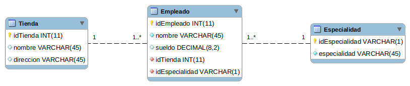

 

# Examen BD 

## Config. Previa

Antes de empezar modifica el par&aacute;metro `prefixUsername` y ponle como valor tu inicial seguida de tu apellido, ejemplo `eserrano` para Eduardo Serrano.

Una vez realizado el cambio guarda el archivo, si lo necesitas refresca la configuraci&oacute;de Gradle en Eclipse. 
Bot&oacute;n derecho sobre el proyecto > Gradle > Refresh Gradle Project.

## Antes de empezar te recomiendo

1. Revisar el docker-compose para ver el puerto en el que está configurado la BD
2. Revisar el docker-compose para ver el SCHEMA de base de datos utilizado

## Instrucciones Precisas
 
Para realizar el examen sólo puedes tocar dos clases:
1. GenericDAOImpl
2. ExamenImpl

Todo lo demás es información necesaria de contexto.

## Puntos
1. GenericDAOImpl - Conexion Compartida - Test01 = 1,5pt
2. GenericDAOImpl - Conexion Individual - Test02 = 1pt
3. ExamenImpl - Login - Test03 = 1pt
4. ExamenImpl - Inserta Persona - Test04 = 1pt
5. ExamenImpl - Consulta Tienda - Test05 = 2,5pt
6. ExamenImpl - Inserta Personas por Lote - Test06 = 1,5pt
7. ExamenImpl - Crea Tabla - Test07 = 1,5pt

## Esquema de Tablas N:M Tienda

### Requisitos para crear una base de datos con MySQL y Docker

1. Tener Instalado Docker  
2. Instalar docker-compose  
`sudo apt install docker-compose`

#### Ubuntu  
[Instrucciones Instalación Docker Ubuntu](https://docs.docker.com/engine/install/ubuntu/)  

#### Windows 10  
[Instrucciones para Instalación Docker Windows](https://docs.docker.com/docker-for-windows/install/)

### Crear el contenedor

Situarse en el directorio de proyecto y ejecutar el siguiente comando  
$>`docker-compose up -d db`

Comprobar contenedores levantados  
$>`docker-compose ps`

Conectar por consola  
$>`docker-compose exec db bash`

### Comandos útiles  

Iniciar contenedores parados, creados previamente  
$>`docker-compose start`

Conectar por consola  
$>`docker-compose exec db bash`

Conectar directamenet al esquema de biblioteca  
$>`docker exec -it mysql1 mysql -udeveloper -p [nombre_bd]`

Cargar fichero sql desde consola  
docker@container>`mysql -udeveloper -p biblioteca < [fichero]`

Consultar ip contenedor desde consola  
$>` docker inspect -f '{{range.NetworkSettings.Networks}}{{.IPAddress}}{{end}}' [container id]`

Eliminar todos los contedores  
$>`docker-compose  rm -s`
